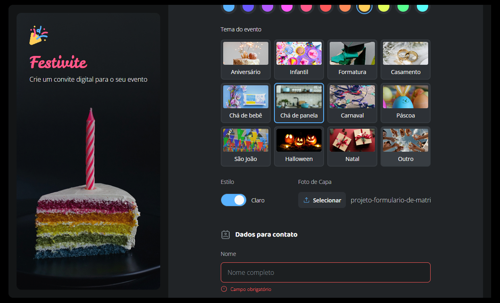

# Projeto: Convite Digital - Festivite 

Este é um projeto de uma página web desenvolvida apenas com HTML5 e CSS3, simulando um convite digital completo. O convite festivite permiteO formulário pertence à escola fictícia "Estrelas do Amanhã" e foi criado como prática de estruturação semântica, estilização modular e experiência de usuário com formulários interativos.

## 🔗 Acesse o projeto online
Você pode visualizar o site publicado via GitHub Pages clicando no link abaixo:

👉 [Acessar Projeto Festivite](https://llorenzojorge.github.io/projeto-festivite/)

## 📌 Objetivo do projeto
- O projeto foi desenvolvido com fins educacionais, como parte da minha prática em desenvolvimento web front-end, com foco em:
- Estrutura semântica de formulários
- Estilização completamente customizada em label e inputs
- Estilização modular com CSS dividido por componentes
- Feedback visual para interações do usuário (como estados de foco e erro)

## 🛠️ Tecnologias utilizadas
- HTML5
- CSS3 e Nesting CSS (com variáveis e arquitetura modular)
- Git e GitHub
- GitHub Pages para deploy

---

Desenvolvido por [Lorenzo Jorge](https://github.com/llorenzojorge) 💻